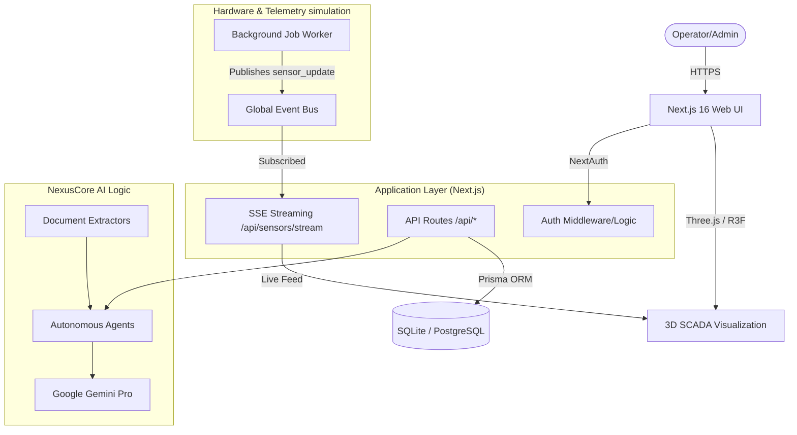

# System Architecture — Elkonmix-90 SCADA & NexusCore AI

This document details the high-level architecture of the Elkonmix-90 SCADA system and its integration with the NexusCore AI framework.

## Architecture Diagram

## Component Breakdown

### 1. Frontend (Next.js + Three.js)
- **Interactive 3D**: Uses React Three Fiber to render a procedural model of the Elkonmix-90 plant.
- **SCADA UI**: A multi-tab dashboard implemented with Tailwind CSS and shadcn/ui.
- **SSE Integration**: A custom `useSensorStream` hook connects to the backend to receive live telemetry.

### 2. Backend (API & Real-time)
- **REST API**: Standard Next.js Route Handlers for CRUD operations (Recipe, Inventory, Production).
- **Event Bus**: A singleton `EventEmitter` in `src/lib/events.ts` that acts as the central hub for system events.
- **SSE Stream**: Server-Sent Events endpoint that pushes `sensor_update` events from the bus to the client.

### 3. NexusCore AI
- **Agents**: Specialized AI agents that use LLMs (Gemini) to perform complex tasks like parsing physical delivery notes or optimizing recipes.
- **Extractors**: Library for extracting text and data from PDFs, Excel files, and images (OCR).

### 4. Database (Prisma)
- **Schema**: Centralized relational schema defining the plant state, history, and operator roles.
- **Adapter**: Flexible adapter pattern allowing seamless switching between SQLite (local) and PostgreSQL (production).

## Data Flow: Real-time Telemetry
1. **BackgroundWorker** simulates plant sensors and emits values every 5 seconds.
2. Values are published to the **Global Event Bus**.
3. The **SSE Route** picks up these events and streams them to all connected operators.
4. The **3D Visualization** receives the stream and updates silo heights and animator states instantly.
